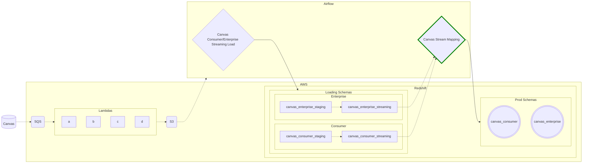

# Canvas Stream Mapping

This dag is apart of the canvas streaming process. This airflow job collects data generated from the airflow loading job (the source data for this dag is stored in the `canvas_consumer_streaming` and `canvas_enterprise_steaming` redshift schemas) and applies transformations to produce the final production tables within the `canvas_consumer` and `canvas_enteprise` redshift schemas.

## Contributing
There are two data generating scenarios managed within this job directory
1. Historical data from the canvas bulk export needs to be merged with transformed data generated by the stream
2. Data needs to be transformed from the stream, there are no canvas bulk export dependencies

-----

### Scenario #1
The canvas stream was introduced in July of 2023. Prior to the stream certain data points such as user creation or course creation were collected from the canvas bulk export. The stream does not provide historical data, so data from the bulk export must be merged with stream data to ensure data points prior July 2023 are not lost. The development process for this has the following steps
1. Develop and run a **single run** `.py` file inside the [canvas_stream_mapping/bulk_export_transfers](./bulk_export_transfers/) directory. 
    - See [canvas_stream_mapping/bulk_export_transfers/README.md](./bulk_export_transfers/README.md) for more information on these `.py` files
2. Run the `.py` file locally, which creates the production table and transfers historical data points from the bulk export to the production table.
3. Add an `.sql` file to [canvas_stream_mapping/sql](./sql/)
    - See [canvas_stream_mapping/sql/README.md](./sql/README.md) for more information on these `.sql` files
4. The sql file contains the logic for updating the production table with data generated by the streaming process, and is activated routinely by this airflow job.

----

### Scenario #2
In this scenario, the production table is created and updated by a single sql file, and no `bulk_export_transfers/*.py` file is required. In this scenario, you will need to add the line `` to the sql file, which instructs airflow that the production table does not exist for the very first run of the task. 
- See [canvas_stream_mapping/sql/README.md](./sql/README.md) for more information on these `.sql` files

----