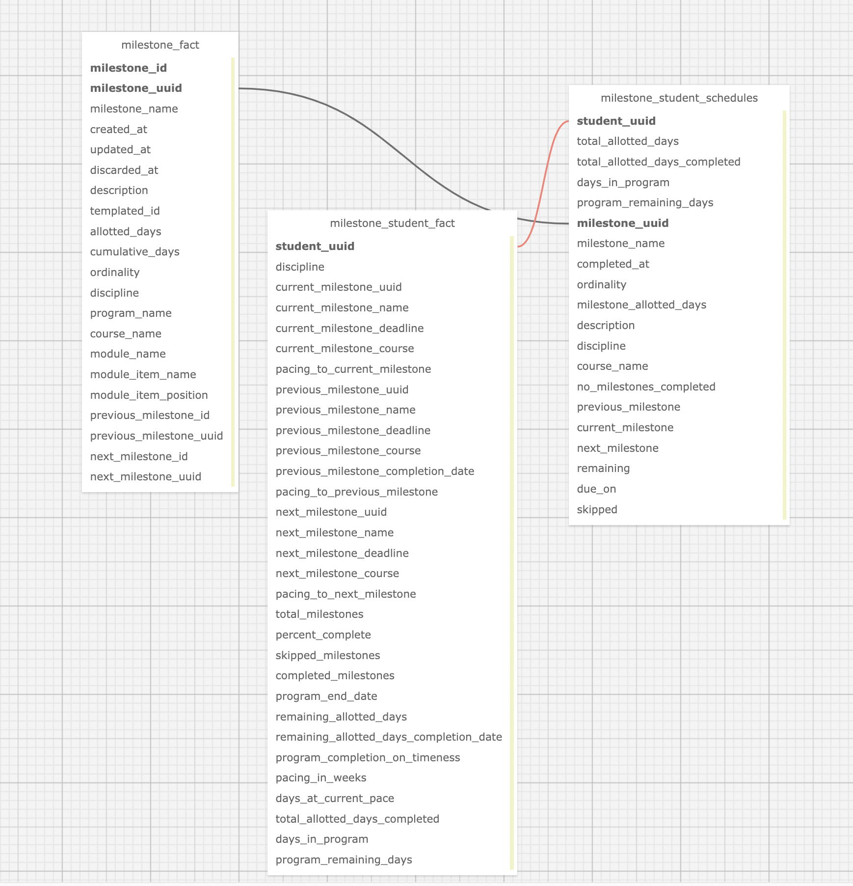

## milestone_facts

There are two primary goals for this dag:

1. Generate a tabular dataset that mirrors the milestone completion schedule seen at `https://guide.flatironschool.com/students/<student uuid>/milestones`
2. Lower querying complexity for common questions related to milestones and student milestone progress.

This dag creates the following tables:

- `fis.milestone_fact`
- `fis.milestone_student_schedules`
- `fis.milestone_student_fact`

